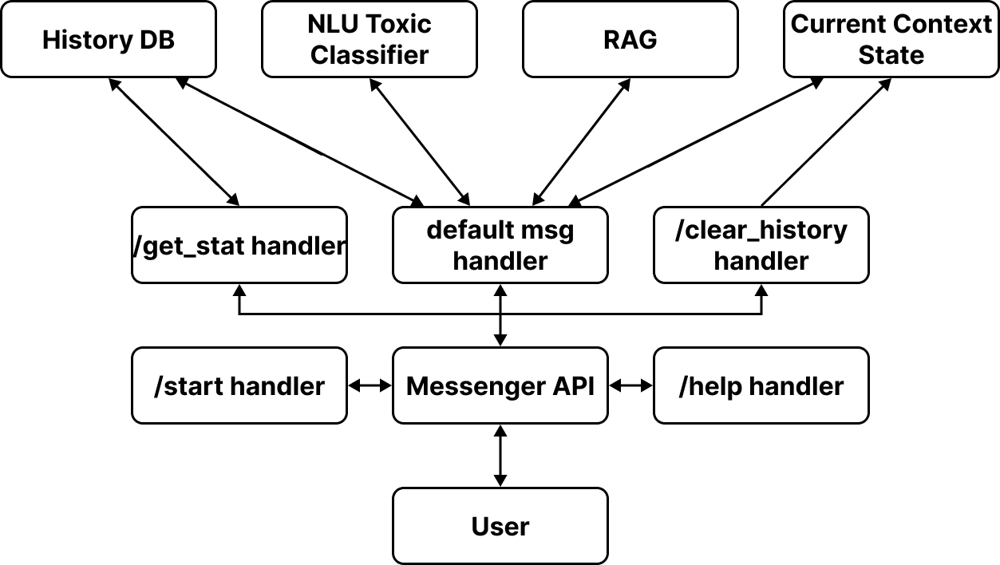
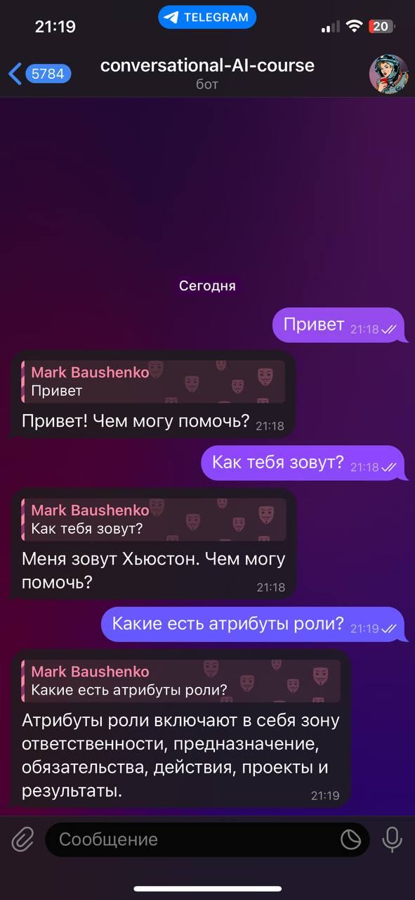
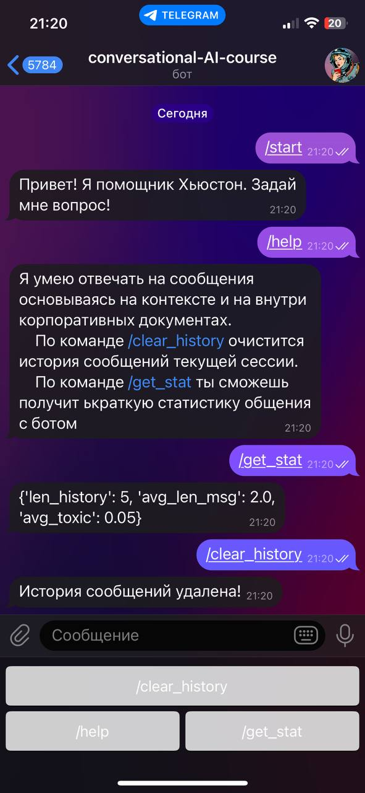

# HR Bot — Хьюстон!
Привет! Меня зовут Хьюстон, и я ваш виртуальный HR-помощник, созданный, чтобы сделать ваш рабочий процесс немного проще и приятнее. Я здесь, чтобы помочь вам с различными HR-запросами и предоставить нужную информацию быстро и эффективно.

# Quick Start
## Requirements
- Python >= 3.11

## Docker build
1. `git clone https://github.com/e0xextazy/conversational-AI-course.git`
2. `docker build -t <YOUR_IMAGE_NAME> .`
3. `docker run -e TGBOT_TOKEN=<TG_TOKEN> -e OPENAI_API_KEY=<OPENAI_TOKEN> <YOUR_IMAGE_NAME>`

## Docker pull
1. `docker pull mbaushenko/ai-conv-bot:latest`
2. `docker run -e TGBOT_TOKEN=<TG_TOKEN> -e OPENAI_API_KEY=<OPENAI_TOKEN> mbaushenko/ai-conv-bot:latest`

## From source
1. `git clone https://github.com/e0xextazy/conversational-AI-course.git`
2. `cd conversational-AI-course`
3. `python -m venv venv`
4. `source venv/bin/activate`
5. `pip install -r requirements.txt`
6. `python src/app.py`

# Functional
- **Q/A общение** — вы можете общаться со мной на свободные темы или же получать ответ по HR вопросам внутри компании
- **`/clear_history`** — очистка истории сообщений для активной сессии
- **`/help`** — краткий гайд по командам внутри бота
- **`/get_stat`** — возвращает небольшую статистику на основе вашей переписки с ботом
    - Всего сообщений
    - Средняя длина ваших сообщений
    - Оценка вашей токсичности на протяжении всего общения с ботом
- **Toxic Filter** — на грубые сообщения я отвечать не буду :)

# Scheme

    

> **_NOTE:_**  Если плохо видно стрелочки, включите светлую тему

# Example
- Пример свободного общения

    

- Пример вызовов команд

    

# Team
- Baushenko Mark
- Zagorulko Oleg
